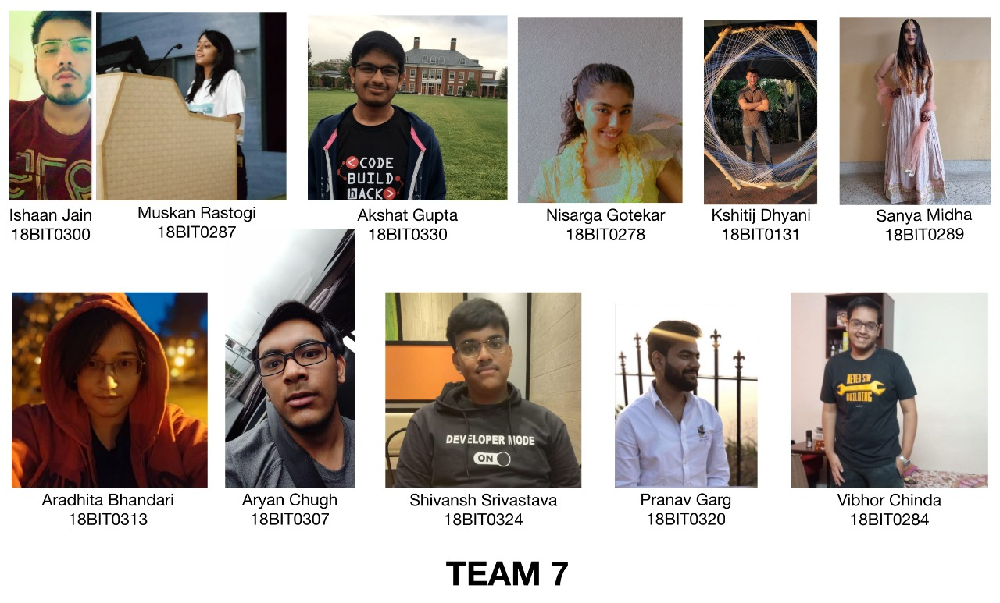

# Group Activity 1
### Problem Statement:
Assume you are a part of the NLP Tech team that works for a Publishing House. There is a shortlisted applicant (with her writing samples) for the Editor-in-chief position. How can you help the publishing house with the decision on hiring this applicant?

Design a pipeline for this problem statement. Showcase the outcomes of step in the pipeline (put it on chat) at 8.20 AM, 8.30 AM and 8.40 AM along with team number. Finally submit a collage of pics of members of each team showing names and registration numbers by 2.00 PM. 


## Approach
1. Digitising text
2. Analysing the text.
3. Breaking the text into simple components.
4. Counting the words
5. Using cosine vectorizer to compare.
6. If similar words repeated and similar writing style, it's the same person.

## Top Language

[](https://github.com/akshatvg/)

## Instructions to Run
1.
```bash
$ git clone https://github.com/akshatvg/NLP-Tasks
$ cd NLP-Tasks
$ mkdir Datasets && cd Datasets
```
2. Install [glove.6B.50d.txt](https://www.kaggle.com/watts2/glove6b50dtxt) in Datasets
3.
```bash
$ cd .. && jupyter-notebook
```
4. Run the Kernel

## Group Collage
<p align="center">

</p>

## Need help?


Feel free to contact me via [Facebook](https://www.facebook.com/akshatvg).

Invite me to connect on [LinkedIn](https://www.linkedin.com/in/akshatvg/).

[](https://www.facebook.com/akshatvg) [](https://www.quora.com/profile/Akshat-Gupta-279) [](https://www.instagram.com/akshatvg/) [](https://www.snapchat.com/add/akshatvg) [](https://medium.com/@akshatvg)


```bash


 _____ _                 _     __   __            
|_   _| |               | |    \ \ / /            
  | | | |__   __ _ _ __ | | __  \ V /___  _   _   
  | | | '_ \ / _` | '_ \| |/ /   \ // _ \| | | |  
  | | | | | | (_| | | | |   <    | | (_) | |_| |  
  \_/ |_| |_|\__,_|_| |_|_|\_\   \_/\___/ \__,_|  
                                                  
                                                  
______                                            
|  ___|                                           
| |_ ___  _ __                                    
|  _/ _ \| '__|                                   
| || (_) | |                                      
\_| \___/|_|                                      
                                                  
                                                  
______      _               _   _               _ 
| ___ \    (_)             | | | |             | |
| |_/ / ___ _ _ __   __ _  | |_| | ___ _ __ ___| |
| ___ \/ _ \ | '_ \ / _` | |  _  |/ _ \ '__/ _ \ |
| |_/ /  __/ | | | | (_| | | | | |  __/ | |  __/_|
\____/ \___|_|_| |_|\__, | \_| |_/\___|_|  \___(_)
                     __/ |                        
                    |___/                         

 


```

## License

**MIT &copy; [Akshat Gupta](https://github.com/akshatvg/NLP-Tasks/blob/master/LICENSE)**

[](https://github.com/akshatvg/NLP-Tasks/blob/master/LICENSE) [](https://twitter.com/akshatvg)

---------

```javascript

if (youEnjoyed) {
    starThisRepository();
}

```

-----------

